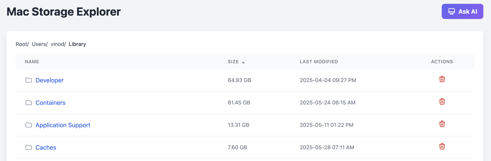

# Mac Directory Size Explorer

A modern web application to explore and manage directory sizes on macOS, with AI-powered suggestions for space optimization.


*Main interface showing directory contents sorted by size*

## Features

- **Directory Size Analysis**: View directory contents sorted by size with a clean, modern interface
- **Interactive Navigation**: Navigate through directories with an intuitive breadcrumb interface
- **Smart Sorting**: Sort directories by name, type, or size (default: size descending)
- **AI Integration**: Get AI-powered suggestions for space optimization by analyzing your largest directories
- **Safe Deletion**: Move directories to Trash with proper validation and safety checks
- **Real-time Feedback**: Loading indicators with elapsed time tracking
- **Responsive Design**: Works seamlessly on all screen sizes


*AI-powered suggestions for space optimization*

## Prerequisites

- Python 3.7 or higher
- macOS operating system
- pip (Python package manager)

## Installation

1. Clone the repository:
```bash
git clone https://github.com/kvr2277/mac-directory-explorer.git
cd mac-directory-explorer
```

2. Create and activate a virtual environment (recommended):
```bash
python -m venv venv
source venv/bin/activate  # On macOS/Linux
```

3. Install dependencies:
```bash
pip install -r requirements.txt
```

4. Create a `.env` file in the project root with your configuration:
```env
FLASK_APP=app.py
FLASK_ENV=development
DEFAULT_PATH=/path/to/your/default/directory
```

## Usage

1. Start the application:
```bash
flask run
```

2. Open your web browser and navigate to `http://localhost:5000`

3. Key Features:
   - Navigate through directories using the breadcrumb navigation
   - Sort contents by clicking column headers
   - Use the "Ask AI" button to get suggestions for space optimization
   - Click the trash icon to safely move directories to Trash
   - View directory contents and sizes before deletion


*Safe deletion process with directory contents preview*

## Development

### Project Structure
```
mac-directory-explorer/
├── app.py              # Main Flask application
├── requirements.txt    # Python dependencies
├── .env               # Environment variables (not in version control)
├── .env.example       # Example environment variables
├── .gitignore        # Git ignore rules
├── docs/             # Documentation and images
│   └── images/       # Screenshots and diagrams
└── templates/         # HTML templates
    └── index.html    # Main application template
```

### Environment Variables
- `FLASK_APP`: The main application file (default: app.py)
- `FLASK_ENV`: Development environment (development/production)
- `DEFAULT_PATH`: Default directory to explore on startup

## Contributing

1. Fork the repository
2. Create a feature branch
3. Commit your changes
4. Push to the branch
5. Create a Pull Request

## License

This project is licensed under the MIT License - see the LICENSE file for details.

## Acknowledgments

- Built with Flask and TailwindCSS
- AI suggestions powered by ChatGPT
- Icons from Heroicons 


